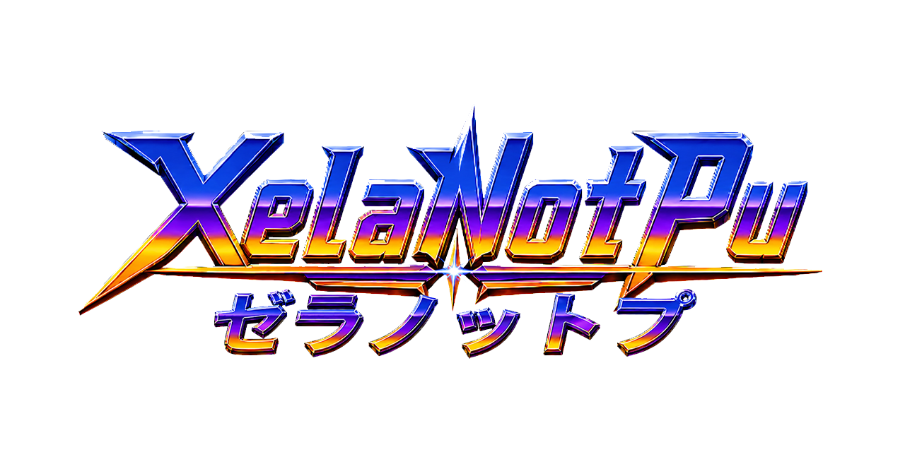

  

# SYSTEMFL — Namco System FL (PATREON edition)

Namco **System FL** arcade for the [MiSTer platform](https://github.com/MiSTer-devel/Main_MiSTer/wiki). System FL (1994) is the sprite-scaling racer board behind *Speed Racer* and *Final Lap R*: an **Intel i960KA** 32-bit RISC CPU, three Namco video customs — **C123** tilemaps, **C169** road (line-mode affine ROZ) and **C355** sprites — the **C116** palette/mixer, and the **C352** 32-voice PCM sound chip driven by a **C75** sound MCU (M37702 core). Native video is 288×224 progressive at 6.048 MHz pixel clock; the program, work RAM and all graphics ROM live in the DE10-Nano's SDRAM, the road and sprite layers are composed one frame ahead into DDR3 framebuffers.

No FPGA implementation of this board existed before. The i960KA CPU and every video custom are original re-implementations by **XelaNotPu**, using MAME's `namcofl.cpp` driver as the behavioural reference; the C75/M37702 MCU and the C352 come from XelaNotPu's Namco System 11 core. Core name **XNSYSTEMFL** — every MRA here references `<rbf>Arcade-XNSYSTEMFL_20260923</rbf>`, matching `_Arcade/cores/Arcade-XNSYSTEMFL_20260923.rbf` (md5 `b9ac2aaffabdfd457ab06ab9e8c48a86`).

## Games

One primary MRA per title under `_Arcade/_XelaNotPu/`; the other Final Lap R versions under `_Arcade/_XelaNotPu/_alternatives/_Final Lap R/`. Complete MAME System FL catalog coverage — 5 sets across 2 titles:

| Title (primary) | MAME set | Hardware verified |
|---|---|---|
| Speed Racer (1995) | `speedrcr` | ✔ boots, plays at real time (countdown clock 23 game seconds in 23 real seconds), attract and gameplay sweeps with zero missed scanlines in every layer |
| Final Lap R (Rev. B) (1994) | `finalapr` | ✔ boots to a playable race from a fresh install (factory NVRAM seeded), clean picture |
| Final Lap R (World) | `finalapr1` | MRA CRC-verified (same engine) |
| Final Lap R (Japan Rev. C) | `finalaprj` | ✔ launches clean from the `_alternatives` layout |
| Final Lap R (Japan Rev. B) | `finalaprj1` | MRA CRC-verified (same engine) |

The Final Lap R regional versions need **split** clone zips in `games/mame/`; a merged `finalapr.zip` serves only the parent set. Speed Racer is set to 3 credits per play by its own factory defaults.

## New in 2026-09-23 — first Supporter release

- **Zero missed scanlines.** System FL is a memory-bandwidth board: every line the road, sprite and tilemap customs and the i960 all want the same SDRAM. Fifteen hardware-validated builds went into this: a two-tier priority arbiter (video ROM fetches and audio ahead of the CPU, anti-starvation for the CPU), deadline-urgency scheduling among the video clients, the SDRAM controller at 100 MHz with a read-ahead block cache and 128-bit client reads, a per-tile mask cache in the road chip and a 4× larger pixel cache in the sprite chip, and finally the road and sprite layers composed **one frame ahead into DDR3 framebuffers** so the scanline race is gone. Multi-minute attract and gameplay sweeps of both games report 0 missed lines in all layers.
- **Real-time game speed.** The i960 gained an instruction cache that fills a whole block per miss, a one-block data read buffer and an on-chip **register frame cache** (four frames, like the real chip's local-register stack), with the interrupt-entry / stack-switch return case fixed on silicon. Speed Racer's on-screen countdown runs 1:1 against a stopwatch on this exact bitstream.
- **Fast-loading MRAs**: one contiguous index-0 ROM stream (a 22 MB set loads in seconds), C75 BIOS at index 8, factory NVRAM seed at index 9 (a saved `.nvm` overrides it), per-game config at index 10, pause screen at index 11.

## Audio

**C352 through the C75 firmware** — 32 voices, front stereo, 42 kHz sample cadence, validated in simulation (656.25 Hz reference tone, no voice dropout) and on hardware (audio is a high-priority SDRAM client; drop counter 0 under full video load). The C75 MCU program (`namcoc75`) loads at runtime from your own romset — no firmware ships in the bitstream.

## Controls

Per-game labels come from each MRA's `<buttons>` tag; the last button is **Pause**.
- **Speed Racer**: `A` Accelerator, `B` Start / Jump, `X Y L` Weapon 1 / 2 / 3, `R` Coin, `Select` Service, `Start` Test.
- **Final Lap R**: `A` Accelerator, `B` Brake, `X` Shifter, `R` Coin, `Select` Service, `Start` Test.
- **Steering**: OSD → *Steering* = Joystick, Analog axis or Paddle; **Accelerator** = Button or Analog axis. MiSTer's normalised analog axes, so a USB wheel and pedals work as expected alongside a plain joystick.
- DIP switch **Freeze Screen** (the board's only DIP) is exposed in the OSD; **Pause when OSD is open** defaults to Off.

## Pause button and supporter credits screen

A real Pause button, mappable in the OSD (last in the button list) or the **P** key on a keyboard. Pausing shows the supporter credits screen (gold Hall of Fame, cyan High Score, green Insert Coin) delivered inside each `.mra` (`<rom index="11">`); the game freezes silently and resumes on the next press.

## CRT Adjust (analog)

**CRT Adjust** (OSD → CRT Adjust page): On/Off, H-Size, H-Position, V-Shift for analog CRTs, sync kept native. Default **Off**.

## DB9 / DB15 / Saturn controllers (UserIO)

Native retro-controller input on the USER port, for Antonio Villena-style DB9/SNAC8 splitter hardware. OSD → **UserIO Joystick**: Off / Saturn / DB9 MD / DB15.

- **DB9 MD** — Mega Drive 3/6-button pads.
- **DB15** — Neo Geo-style DB15 sticks.
- **Saturn** — Saturn digital pads.
- USB pads keep working — DB9/DB15 input is OR-merged with USB (and muted while the OSD is open). OSD navigation from the stick itself needs the MiSTer-DB9 firmware; using the 8th user-port line means the rare secondary SPI-SD add-on stays unsupported.

## Video

288×224 progressive, no interlace and no rotation — what the board outputs is what the core outputs. C123 tilemaps are composed per scanline; the C169 road and C355 sprite layers lag the tile layer by exactly one frame (invisible in motion). The FPGA is 97 % full with every clock closing timing cleanly.

## Install

Copy the contents of `_Arcade/` onto your SD card's `_Arcade/` folder: this places `Speed Racer.mra` and `Final Lap R (Rev. B).mra` in `_Arcade/_XelaNotPu/`, the other Final Lap R versions in `_Arcade/_XelaNotPu/_alternatives/_Final Lap R/`, and `Arcade-XNSYSTEMFL_20260923.rbf` in `_Arcade/cores/` (a second copy of the bitstream is in `cores/`). Browse to `_XelaNotPu` in the arcade list. Provide your own romsets in `games/mame/` (`speedrcr.zip`, `finalapr.zip`, the split clone zips and `namcoc75.zip`) — nothing copyrighted is included.

## Source

This repository is the complete corresponding source of the shipped bitstream: `rtl/`, `sys/`, `sim/`, `tools/`, `docs/`, the Quartus 17.0.2 project (`SYSTEMFL.qpf/.qsf/.sdc/.sv`, `files.qip`) and `pause_src/`. `SYSTEMFL.sv` carries the compiled PATREON configuration (`DEBUG=0`, `PAUSE_SCREEN=1`). See `README-source.md` (layout, rebuild steps), `BUILD_INFO.txt` (commit, fit and timing of this exact build), `3rdParty_Obligations/` (the CRT Adjust and MiSTer-DB9 GPL subsets with diffs against upstream) and `SHA256SUMS`, which covers every file here.

## Credits & attribution

This core stands on the work of others, gratefully acknowledged:

- **The MiSTer project** and its framework (`sys/`) — Alexey Melnikov (**Sorgelig**) and the MiSTer-devel contributors.
- **MiSTer-CRT-Adjust** — **Umberto Parisi (rmonic79)** with **Andrea Bogazzi**: the core-side analog CRT geometry module (`crt_adjust.sv`, plus the MLAB-buffer variant used here because the FPGA's block RAM is full).
- **MiSTer-DB9 / DB9-Pro** — DB9/DB15/Saturn splitter support for **Antonio Villena**'s DB9/SNAC8 splitter hardware; control modules by **Aitor Pelaez (NeuroRulez)**, based on work by **Victor Trucco** and **Fernando Mosquera**; Saturn protocol adaptation by **Timothy Redaelli**.
- **The MAME project** — `namcofl.cpp` and the shared Namco devices (R. Belmont, ElSemi and contributors), the hardware documentation and reference behaviour used to develop System FL support as an independent re-implementation; MAME's recent C169 road rewrite was the reference for the line-mode road semantics.
- **Namco System FL board support and chip re-implementations** — **XelaNotPu**: the i960KA CPU (instruction cache, read buffer, register frame cache), the C116/C123/C169/C355 video customs, the SDRAM controller and client arbiter, the frame-ahead DDR3 layer framebuffers, the C75/M37702 MCU and C352 PCM (from the System 11 core), the pause/credits overlay (from the System 12 core), the fast-loading MRA tooling, and the XN artwork and README banner.

## Legal

**No Affiliation.** This project is unofficial and not affiliated with, endorsed by, or sponsored by Bandai Namco Entertainment, Namco, or any other rights holder.

**Trademarks.** Namco, System FL, Speed Racer (arcade game) and Final Lap R and all associated game titles, characters and logos are trademarks or registered trademarks of their respective owners (including Bandai Namco Entertainment Inc.; *Speed Racer* is a trademark of Speed Racer Enterprises, Inc.). Intel and i960 are trademarks of Intel Corporation. Sega, Mega Drive, and Saturn are trademarks of SEGA Corporation; Neo Geo is a trademark of SNK Corporation — referenced solely to identify the third-party controllers the DB9/DB15 feature supports. All such names are used in a purely nominative and descriptive manner, solely to identify the hardware and games being re-implemented or referenced.

**No ROMs or Copyrighted Data.** This core contains and distributes NO copyrighted ROMs, BIOS images, game data, NVRAM images or firmware. Users must supply their own legally-obtained ROM dumps, made from original hardware or media they legally own, where and to the extent their local law permits. The bitstream embeds no game ROMs and no manufacturer firmware; the C75 sound-MCU program and the factory NVRAM seed load at runtime from user-supplied files, and `roms/*.json` hold only part names, sizes and checksums.

**Purpose.** This is a preservation and interoperability project. The hardware behaviour was re-implemented independently, using MAME as behavioural reference documentation; no proprietary source code was used and no MAME emulator code is present in the bitstream.

**User Responsibility.** Users are solely responsible for ensuring that their use of this core — including acquisition and use of any ROM images — complies with copyright law and all other applicable laws in their jurisdiction.

**No Warranty.** This program is provided "AS IS" without warranty of any kind, express or implied, including but not limited to the implied warranties of merchantability and fitness for a particular purpose. The entire risk as to quality and performance is with the user. No copyright holder or contributor shall be liable for any damages arising from the use of this program.

The FPGA source is released under the GNU General Public License v3 or later (see `COPYING.GPL3`; GPLv2-or-later components see `COPYING.GPL2` and `3rdParty_Obligations/`); upstream components retain their respective licenses. The full legal notice is `DISCLAIMER.md`.
